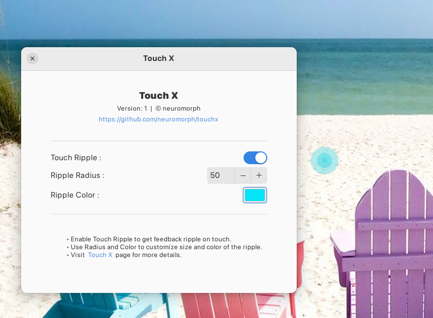

# Touch X (GNOME 4X Extension)  


A GNOME Shell extension for touch screen accessibility. Currently supports ripple feedback where the screen is touched. You can enable/disable the touch-feedback and set its size, duration and color as you see fit.  
Additionally, you can add a toggle button in the panel to force enable or force disable On Screen Keyboard (OSK). When enabled, the OSK will pop up in input fields or with Gnome supported gestures. When disabled, the OSK will not pop up at all. This works regardless of Touchscreen Accessibility settings and regardless of whether the screen is in touch mode or not (laptop vs tablet etc). This is useful when the system isn't behaving as expected by default or when you wish to override the default behavior. 


## Installation

### Recommended

[](https://extensions.gnome.org/extension/6156/touch-x/)

It's recommended to install the extension from
[extensions website](https://extensions.gnome.org/extension/6156/touch-x/), or from
the _Extension Manager_ app.


### How to manually install the extension (if needed)?

```
git clone https://github.com/neuromorph/touchx.git \
	~/.local/share/gnome-shell/extensions/touchx@neuromorph
```
OR download the release zip file (may not be latest) and unzip at location: ~/.local/share/gnome-shell/extensions/

You may need to restart the gnome shell environnment (for manual install):

- logout and login again (Do this if using Wayland) _or_
- `alt+f2` then type `r` and `enter` 

## Settings
Use the settings panel of the extension for customizations:
- Enable / Disable feedback ripple
- Set ripple size
- Set ripple color
- Set ripple time duration
- Panel OSK button to force enable/disable OSK


## What's New (recent first)
- Panel OSK button to force enable/disable OSK
- Desktop long-press menu bug fix and added support for ripple duration
- Initial version created


## Screenshots

   
 


